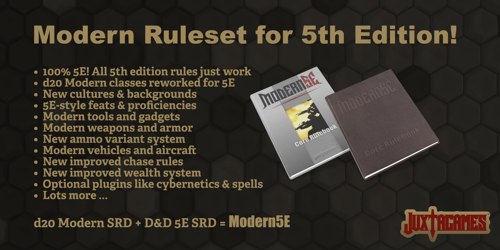

# Modern5E

Modern5E is the d20 Modern tabletop roleplaying game updated for the Dungeons & Dragons 5th Edition rules utilizing the Open Game License (OGL) v.1.0a by [Wizards of the Coast](https://company.wizards.com); see [legal.md](https://github.com/Juxtagames/Modern5E/blob/master/legal.md) document in the above directory for license information.

In more detail, Modern5E will utilize material from both the [d20 Modern SRD](https://en.wikipedia.org/wiki/D20_Modern) v1.0 and the newly [REmastered Dungeons & Dragons 5th Edition SRD](https://ogl-srd5.com) - based upon the official SRD v5.1 by [Wizards](https://dnd.wizards.com/articles/features/systems-reference-document-srd) - to create a unique modern version of the 5E rules.

There are two versions of the Modern5E rules available to the public.

* **The Modern5E Ruleset** is maintained in seperate sections, chapters and pages to use in your own projects and publications via the OGL. This Ruleset is available here as a FREE download. There is no premium compiled version of the ruleset to use at the gametable, though individuals are welcome to compile their own tabletop edition from the available Ruleset. All pages are written in Markdown (.md) format for ease of conversion; see below for more information on the Markdown format.
* **The Modern5E Core Rulebook** is a commercialy printed product available in softcover, hardcover and a deluxe edition. The Core Rulebook is also available as a compiled PDF. The Core Rulebook is a premium product specifically designed for use at the tabletop or your online game sessions. As such, the Core Rulebook contains additional material, gameplay examples, and artwork all geared towards understanding, learning and enhancing the actual gameplay. The physical and PDF editions of the Core Rulebook can be purchased at [Juxtagames](https://www.juxtagames.com). Your purchase of the premium Core Rulebook and other publications help support the project by offseting the costs of writing, editing, artwork, materials, hosting and other necessary assets.

## Future Publications

Future publications will expand the rules by adding such things as fantasy races, magic, cybernetics, aliens, space travel, super heroes and more. Much of this material will be available as supplements and campaigns; see the [Juxtagames](https://www.juxtagames.com) website for more information on the Expansion Kits.

# Ruleset Downloads

The Modern5E Ruleset is be available here in Markdown (.md) format, but there are a few different options.

* To download any public release of specific sections, chapters or pages, visit the [pages](https://github.com/Juxtagames/Modern5E/tree/master/pages) directory above under the default Master Branch.
* To download the entire library of ALL pages in a single package, visit [Releases](https://github.com/Juxtagames/Modern5E/releases) for the default Master Branch.

# Work in Progress

The Work in Progress (WIP) files are located in the WIP Branch under the [pages](https://github.com/Juxtagames/Modern5E/tree/wip/pages) directory which contains all the project files currently under development, either as errata or clairification updates, optional or supplimental rules, playtesting, or for future editions.

### Why Markdown Format?

Markdown is a lightweight markup language in plain text created by [John Gruber](https://daringfireball.net/). By its very nature, Markdown (.md) is a plain text format and can therfore be opened in any word processor. However, Markdown contains specific syntax built into the text which allows a Markdown Editor to compile the document into Richtext. In addition, Markdown Editors can easily export Markdown into a multitude of formats, like HTML and nearly any publishing extension from Microsoft Word to Adobe InDesign and everything in between. Markdown is often used to format readme files and wikis, but also to write books, blogs, and messages. Over the years Markdown has become more and more versitile, and therefore more popular. In fact, the majority of new writers today are now using Markdown over other formats.

As mentioned, Markdown (.md) files can be open in any text editor. However, Microsoft Word and other plain text application do not process the Markdown Syntax. As such, there will be more work involved to utilize the material and remove or convert the syntax to a usable Richtext format. There are numerous Markdown Editors available, many for free. To convert Markdown to another format we suggest using [PanWriter](https://panwriter.com) in conjuction with Pandoc; it is simply the easiest and best way to convert Markdown files, and it is available for FREE!

## Track Work in Progress

 * To view and read the latest blog posts visit [Juxtagames](https://juxtagames.com)
 * To view general information and goals visit [Wiki](https://github.com/Juxtagames/Modern5E/wiki).
 * To view the project outline and tasks visit [Projects](https://github.com/Juxtagames/Modern5E/projects).
 * To view the progress of this project visit [Milestones](https://github.com/Juxtagames/Modern5E/milestones).
 * To view a summary of changes to the public release files visit [Changelog](https://github.com/Juxtagames/Modern5E/blob/master/changelog.md).

## Participation

To participate in this project, a free [Github Account](https://github.com/join) is required.

 * To post feedback, requests, suggestions or questions visit [Discussions](https://github.com/Juxtagames/Modern5E/discussions).
 * To report problems in game balance or mechanics visit [Issues](https://github.com/Juxtagames/Modern5E/issues), or create a [Pull Request](https://github.com/Juxtagames/Modern5E/pulls).
 * To *Download*, *Clone* or *Fork* the Master or WIP repositories visit [Github Help](https://docs.github.com).

# Support Us

Anyone can support this project through our Patreon and Kickstarter campaigns. To maintain Modern5E and to publish future supplements and campaign sourcebooks we will need help paying for artwork, writing, editing, layout, software, hardware, hosting and other tech services. Those who support the project in this manner will receive special commendation and backer rewards, visit those project campaigns for more information. Also, news of these campaigns will be available through our website, social media accounts (see below) and our newsletter.

To support this project - until our official support channels and campaigns become available - you can contribute funds below ...

[$5](https://paypal.me/umbergerba/5) | [$10](https://paypal.me/umbergerba/10) | [$25](https://paypal.me/umbergerba/25) | [$50](https://paypal.me/umbergerba/50) | [$100](https://paypal.me/umbergerba/100) | [Custom](https://paypal.me/umbergerba)

***Thanks for your support!***

---

 [Website](https://shop.juxtagames.com) | [Twitter](https://twitter.com/juxtagames) | [Pinterest](https://pinterest.com/juxtagames) | [Reddit](https://reddit.com/user/juxtagames) | [Youtube](https://www.youtube.com/channel/UCckbaZDR1oRVjTFIZBthaQA) | [Patreon](https://www.patreon.com/juxtagames) | [Kickstarter](https://www.kickstarter.com/profile/juxtagames)

> Copyright 2020 Juxtagames, LLC. All Rights Reserved. This project, known as *Modern5E*, is published under the Open Game License (OGL) v1.0a by [Wizards of the Coast](https://wizards.com). We make no claim or challenge to any trademarks owned by [Wizards of the Coast](https://wizards.com). In addition, this material utilizes the D20 Modern SRD and the Dungeons & Dragons SRD v5.1, both published by [Wizards of the Coast](https://wizards.com). As defined in the OGL v1.0a Section 1(e): We hereby acknowledge this material contains no product identity owned by Juxtagames or any other company or individual.
