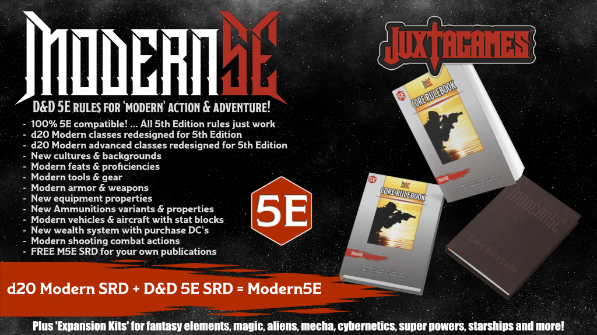

# M5E Systems Reference Document (SRD)

Modern5E (M5E) is a 'modern' adaption of the Dungeons & Dragons 5th Edition rules under the Open Game License (OGL) v.1.0a by [Wizards of the Coast](https://company.wizards.com); see [legal.md](https://github.com/Juxtagames/Modern5E/blob/masterin/legal.md) for license information.

In detail, Modern5E utilizes material from both the [d20 Modern SRD](https://en.wikipedia.org/wiki/D20_Modern) v1.0, and the newly [REmastered Dungeons & Dragons 5th Edition SRD](https://ogl-srd5.com) - based upon the official SRD v5.1 by [Wizards](https://dnd.wizards.com/articles/features/systems-reference-document-srd) to create a uniquely modern version of 5E tabletop roleplaying game for use in your modern actions adventures.

## SRD vs. Core Rulebook

* **The M5E SRD** is the ruleset for anyone to use in Modern5E projects and publications via the OGL. This ruleset is maintained in sections and is available as a FREE download (see 'SRD Downloads' below). The SRD does not contain all the written material found in the commercially licensed products, and there is no compiled version of the ruleset to use at the game table. However, individuals are welcome to assemble their own tabletop editions from the available OGL material. All pages are formatted in Markdown (.MD) for ease of use and conversion.
* **The M5E Core Rulebook** is a commercially licensed product available in various print and digital editions. The Core Rulebook contains additional material not found in the SRD, such as expanded character features, equipment options, gameplay examples, artwork and more. This extra material is designed to enhance the gaming experience, both at the table and online. The physical and digital editions of the Core Rulebook are available at [Juxtagames](https://www.juxtagames.com).

### Why Markdown?

Markdown (.MD) is a lightweight markup language created by [John Gruber](https://daringfireball.net/). At its core, Markdown is a plain text file that contains specific syntax that allows a Markdown editor to compile the document into Richtext. The most significant factor in favor of using Markdown is zero reliance on proprietary formats. Because Markdown is a simple text file, the longevity of the document's structure is significant.

Due to its simple format, any word processor can open Markdown files, but not using an editor built to handle Markdown will constitute more work to remove or convert the syntax to Richtext. A good Markdown editor can also export to a multitude of formats, like .HTML or .DOCX, or nearly any other publishing format. Markdown is often used to create readme files, wikis, books, blogs, messages and more.

There are numerous Markdown Editors available, many for free. We suggest using [PanWriter](https://panwriter.com), which utilizes Pandoc; it is the easiest and best way to convert Markdown files, and it is FREE!

## SRD Downloads

We recommend downloading all files from the **'Master' branch only**.

* To download specific M5E SRD documents, simply browse the directory above.
* To download a package of **ALL** M5E SRD documents, visit [Releases](https://github.com/Juxtagames/Modern5E/releases).

## WIP Downloads

All Modern5E project files currently in-development - in this case, both the Modern5E SRD and the Modern5E Core Rulebook - are located under the ['Work-in-Progress'](https://github.com/Juxtagames/Modern5E/tree/work-in-progress/pages) branch. Be aware, this branch and any extraneous branches outside the 'Master' branch are subject to change at any time.

### WIP Tracking

* To view and read the latest blog, visit [Juxtagames](https://shop.juxtagames.com/blog)
* To view general information and goals, visit [Wiki](https://github.com/Juxtagames/Modern5E/wiki).
* To view the project outline and tasks, visit [Projects](https://github.com/Juxtagames/Modern5E/projects).
* To view the progress of this project, visit [Milestones](https://github.com/Juxtagames/Modern5E/milestones).
* To view changes to the public release pages, visit [Changelog](https://github.com/Juxtagames/Modern5E/blob/masterin/changelog.md).

### WIP Participation

To participate in this project, you will need a free [Github Account](https://github.com/join) account.

* To post feedback, requests, suggestions, or questions, visit [Discussions](https://github.com/Juxtagames/Modern5E/discussions).
* To report problems with game mechanics or balance, visit [Issues](https://github.com/Juxtagames/Modern5E/issues).
* To learn about Github's Pull Request, Clone, or Fork processes, visit [Github Help](https://docs.github.com).

## Support Us

Anyone can support this project through our Patreon and Kickstarter campaigns. For details, visit our website and social media accounts, or subscribe to our newsletter.

To support this project - until our official channels become available - you can contribute funds through the following links.

[$5](https://paypal.me/umbergerba/5) | [$10](https://paypal.me/umbergerba/10) | [$25](https://paypal.me/umbergerba/25) | [$50](https://paypal.me/umbergerba/50) | [$100](https://paypal.me/umbergerba/100) | [Custom](https://paypal.me/umbergerba)

***Thanks for your support!***

---

[Website](https://shop.juxtagames.com) | [Twitter](https://twitter.com/juxtagames) | [Pinterest](https://pinterest.com/juxtagames) | [Reddit](https://reddit.com/user/juxtagames) | [Youtube](https://www.youtube.com/channel/UCckbaZDR1oRVjTFIZBthaQA) | [Patreon](https://www.patreon.com/juxtagames) | [Kickstarter](https://www.kickstarter.com/profile/juxtagames)

> Copyright 2019-2021 Juxtagames, LLC. All Rights Reserved. This project, known as *Modern5E, M5E, Modern5E SRD and Modern5E Core Rulebook*, is published under the Open Game License (OGL) v1.0a by [Wizards of the Coast](https://wizards.com). We make no claim or challenge to any trademarks owned by [Wizards of the Coast](https://wizards.com). Also, this material utilizes the d20 Modern SRD and the Dungeons & Dragons SRD v5.1, both published by [Wizards of the Coast](https://wizards.com). As defined in the OGL v1.0a Section 1(e): We hereby acknowledge the M5E SRD contains no intellectual property.