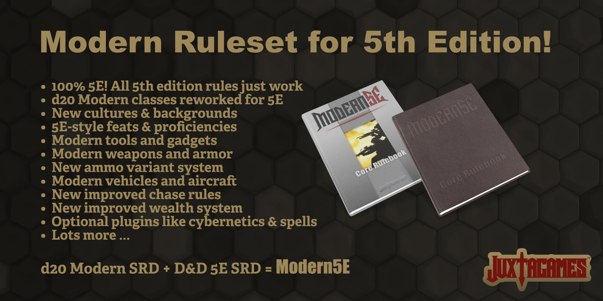

# Modern5E

Modern5E is the d Ruleset

D20 Modern tabletop roleplaying game updated for the D&Dungeons & Dragons 5th Edition rules utilizing the Open Game License (OGL) v.1.0a by [Wizards of the Coast](https://company.wizards.com); see [legal.md](https://github.com/Juxtagames/Modern5E/blob/masterin/legal.md) document in the above directory for license information.

In more detail, *Modern5E* will utilize material from both the [dD20 Modern SRD](https://en.wikipedia.org/wiki/D20_Modern) v1.0 and the newly [REmastered Dungeons & Dragons 5th Edition SRD](https://ogl-srd5.com) - based upon the official SRD v5.1 by [Wizards](https://dnd.wizards.com/articles/features/systems-reference-document-srd) -v5.1 to create a uniquely updated modern version of the 5E rules.

**There are two versions of the Modern5E rules available to the public.**

* **The Modern5E Ruleset** is maintained in separate sections, chapters, and pages to use in your projects and publications via the OGL. This Ruleset is available here as a FREE download. There is no premium compiled version of the Ruleset to use at the game-table, though individuals are welcome to assemble their own tabletop edition from the available OGL materials. All pages are in Markdown (.md) format for ease of conversion; see below for more information on the Markdown format.
* **The Modern5E Core Rulebook** is a commercially printed product available in softcover, hardcover, and a deluxe edition. The Core Rulebook is also available as a compiled PDF. The Core Rulebook is a premium product specifically designed for use at the tabletop or online game sessions. As such, the Core Rulebook contains additional material, gameplay examples, and artwork, all geared towards understanding, learning, and enhancing the actual gameplay. The physical and PDF editions of the Core Rulebook are available at [Juxtagames](https://www.juxtagames.com). Purchase of the Core Rulebook and other publications helps support the project by offsetting the production costs.

## Future Publications

Aside from additional supplements and campaign publications (see Support Us), eventually *Modern5E Kits* will become available, at [Juxtagames](https://www.juxtagames.com). Your purchase of the Core Rulebook and other publications helps support the project by offsetting the costs of writing, editing, artwork, materials, hosting, and ollowing gamemasters to pull together any combination of distinct, separate features for their necessary assets.

## Future Publications

Future Expansion Kits will supplement the rules by adding such things as fantasy races, magic, aliens, monsters, cybernetics, robotics, artificial life, artificial intelligence, mecha, space travel, superheroes, and more of everything like equipparticular campaign; be it fantasy races, magic, cybernetics, aliens and more as these plugins become available.

# Downloads

Public release document,s weapons, armor, vehicles, spells, races, more, more, and more. Optional plug-ins may cover things like fame and glory points, sanity or dread rules, mook rules; the list goes on! Everything is designed in the likeness and simplicity of 5th Edition to help preserve game balance and ease of play. Much of this material will be available in supplements and/or campaign publications; see the [Juxtagames](https://www.juxtagames.com) website for more information on the Expansion Kits.

# Ruleset Downloads

The Modern5E Ruleset is available for download in Markdown (.md) only. Please note, it is best to download all files from the **Master Branch Only**. The Work-in-Progress Branch - and any extraneous branches - is for those who wish to review future changes or specific files in progress. Files outside the Master Branch are subject to change at anytimeill be available in several publishing formats, like Microsoft Word (.docx), Adobe InCopy/InDesign (.icml), and many more.

 * To download a specific release document, visit the [RELEASE](https://github.com/Juxtagames/Modern5E/tree/main/RELEASE) directory.
 * To download a release package of all files, visit [Releases](https://github.com/Juxtagames/Modern5E/releases).

 * To download any public release of specific sections, chapters, or pages, visit the [pageor view files currently under development, visit the [Work in Progress](https://github.com/Juxtagames/Modern5E/tree/master/pagesin/WIP) directory above.
* To download the entire library of ALL pages in a single package, visit [Releases](https://github.com/Juxtagames/Modern5E/releases)(see below).

Premium PDFs are available for purchase, visit the [Juxtagames Shop](https://shop.juxtagames.com) for more information.

# Work in Progress

The *Work in Progress (WIP) files are in the WIP Branch under the [pages* or [WIP](https://github.com/Juxtagames/Modern5E/tree/work-in-progress/pagesmain/WIP) directory, which contains all the project files currently under development, either as errata or clarification updates, optional or supplemental rules, playtesting, or for future editionsand for these reasons, all WIP files are written in *Markdown* format (.MD).

### Why Markdown Format?

Markdown is a lightweight markup language inwith plain text formatting syntax created by [John Gruber](https://daringfireball.net/). By its very nature, Markdown (.md) is a plain text format and will open in any word processor. However, Markdown contains specific syntax built into the text, which allows a Markdown Editor to compile the document into Richtext. Also, Markdown Editors can easily export Markdown into a multitude of formats, like HTML and nearly any publishing extension from Microsoft Word to Adobe InDesign and everything in betweenit can easily convert to HTML and many other formats using any number of various Markdown editors and translators. Markdown is often used to format readme files and wikis and, write books, blogs, and messages. Over the years, Markdown has become more and more versatile, and therefore more popular. The majority of new writers today are now using Markdown over other formats. 

However, the most significant factor in favor of using Markdown is that you are not relying on any proprietary format belonging to any corporation. Plus, because Markdown is a simple text file, the longevity of the document's structure is basically infinite.

### Markdown Editors

As mentioned, Markdown (.md) files can be open in any text editor, or create rich text using any plain text or Markdown editor.

Markdown files open in any markdown editor and may then be exported to nearly any popular publishing format desired. However, Microsoft Word and otheror any plain text applications do not process the Markdown Syntax. As such, there will be more work involved to utilize the material and remove or convert the syntax to a usable Richtext format. There are numerous Markdown Editors available, many for free. To convert Markdown to another format, we suggest using [PanWriter](https://panwriter.com) in conjunction with Pandoc; it is the easiest and best way to convert Markdown files, and it is available for FREE! can also open markdown (.MD) files, though the markdown syntax is visible, as such there will be much more work involved to utilize the material.

## Track Work in Progress

 * To view and read the latest blog posts, visit [Juxtagames](https://shop.juxtagames.com/blog)
 * To view general information and goals, visit [Wiki](https://github.com/Juxtagames/Modern5E/wiki).
 * To view the project outline and tasks, visit [Projects](https://github.com/Juxtagames/Modern5E/projects).
 * To view the progress of this project, visit [Milestones](https://github.com/Juxtagames/Modern5E/milestones).
 * To view a summary of changes to the public release files, visit [Changelog](https://github.com/Juxtagames/Modern5E/blob/masterin/changelog.md).

## Participation

To participate in this project, you will need a free [Github Account](https://github.com/join) is required.

 * To post feedback, requests, suggestions, or questions, visit [Discussions](https://github.com/Juxtagames/Modern5E/discussions).
 * To report problems in game- balance or mechanics, visit [Issues](https://github.com/Juxtagames/Modern5E/issues), or create a [Pull Request](https://github.com/Juxtagames/Modern5E/pulls).
 * To *Download*, *Clone* or *Fork* the Master or WIPis repositoriesy visit [Github Help](https://docs.github.com).

# Support Us

Anyone can support this project through our Patreon and Kickstarter campaigns. To maintain Modern5E and publish future supplements and; to publish both the *Modern5E ruleset* and several all-new Modern5E campaign sourcebooks, w and supplements. We will need help paying for artwork, writing, editing, layout, quality physical products, software, hardware, hosting, and other tech services, at least until things get up and running like a regular business. Those who support the project in this manner wishall receive special commendation and backer rewards;, visit those project campaigns for more information. The nNews of these campaigns will be available through our website, and social media accounts (see below), and our newsletter.

To support this project - until our official support channels and campaigns become available - you can contribute funds below ...

[$5](https://paypal.me/umbergerba/5) | [$10](https://paypal.me/umbergerba/10) | [$25](https://paypal.me/umbergerba/25) | [$50](https://paypal.me/umbergerba/50) | [$100](https://paypal.me/umbergerba/100) | [Custom](https://paypal.me/umbergerba)

***Thanks for your support!***

---

 [Website](https://shop.juxtagames.com) | [Twitter](https://twitter.com/juxtagames) | [Pinterest](https://pinterest.com/juxtagames) | [Reddit](https://reddit.com/user/juxtagames) | [Tumblr](https://juxtagames.tumblr.com) | [Youtube](https://www.youtube.com/channel/UCckbaZDR1oRVjTFIZBthaQA) | [Patreon](https://www.patreon.com/juxtagames) | [Kickstarter](https://www.kickstarter.com/profile/juxtagames)

> Copyright 2020 Juxtagames, LLC. All Rights Reserved. This project, known as *Modern5E*, is published under the Open Game License (OGL) v1.0a by [Wizards of the Coast](https://wizards.com). We make no claim or challenge to any trademarks owned by [Wizards of the Coast](https://wizards.com). In addition, this material utilizes the D20 Modern SRD and the Dungeons & Dragons SRD v5.1, both published by [Wizards of the Coast](https://wizards.com). As defined in the OGL v1.0a Section 1(e): We hereby acknowledge this material contains no product identity owned by Juxtagames or any other company or individual.